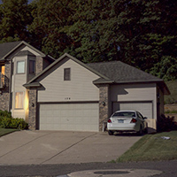

<!-- ---
layout: post
categories: project-item
img-path: images/yh.gif
project-title: Music Videos
--- -->

  

    

      

         <h1 class="title-main-about" id="projectIntro"> Videos </h1>
        <!-- 
 <i> I used to shoot music videos in college
         </i> 
 -->

              <h1 class="title-main-about"> On the Steps </h1>
              <!-- 
 My favorite part about rappers is their work ethic - the hustle, the grind - having a dayjob and hitting the studio at night. I guess it's the same reason I love startups. It's about being young, living your dreams while everyones telling you your stupid. 
 -->

               <!-- 
  This track is slow, so everything from the shutter speed to the editing cuts are slow to keep the style smooth. Tighter focal length and careful lighting. 
 -->

               

                  <iframe class="embed-responsive-item" src="https://www.youtube.com/embed/JkA_sGRfyKA"></iframe>
               

<!--
               <h1 class="title-main-about"> On the Steps </h1>
               

                  <iframe class="embed-responsive-item" src="https://www.youtube.com/embed/JkA_sGRfyKA"></iframe>
               
 -->

<!--
              <h1 class="title-main-about"> S.O.S. </h1>
              
 In recent years, the most popular rap videos are shot on cropped sensors with tight lenses,  it's a nice raw style. 

                 

                This video looks different because many shots are much wider. Wider lenses are great for high energy shots. Wider lenses allow for greater subject movement across the frame while reducing camera movement and shakiness. 

                 

                In hindsight the intro I created was too long. For the 10k viewers of the video, half of them probably stopped watching it before the video even started. 

               

                  <iframe class="embed-responsive-item" src="https://www.youtube.com/embed/1zxIuoUDaXA"></iframe>
               

 -->

               <h1 class="title-main-about"> Salad Days </h1>
              <!-- 

                 <b> <a href="http://pickathon.com/">Pickathon </a> </b>
                is Portland's largest music festival. Like everything in Portland, it's super underground and happens in a forest.
 -->

               

                  <iframe class="embed-responsive-item" src="https://www.youtube.com/embed/VoGNw78eYzc"></iframe>
               

                 <!-- DESKTOP FOOTER NAV -->

              

               

                  <h1 class="title-main-about" id="footer-caption">
                More Stuff Projects </h1>

              

                

                       

                         

                           

                              <a href="/project-item/Mercedes/">
                              
                                  
<b> Mercedes</b>
 </a>

                           

                             

                              <a href="/project-item/AirQuail/">
                              
                                  
<b> Airquail</b>
 </a>

                           

                              

                              <a href="/project-item/As-One/">
                              
                                  
<b> asOne</b>
 </a>

                           

                                 

                              <a href="/project-item/BenzPay/">
                              
                                  
<b> Benzpay</b>
 </a>

                           

<!--
                            

                              <a href="/project-item/More-Projects/">
                              
                                  
<b> More</b>
 </a>

                           
 -->

                             

                              <a href="/">
                              
                                  
<b> Home</b>
 </a>

                           

                    

                   

                  

      

    

  

