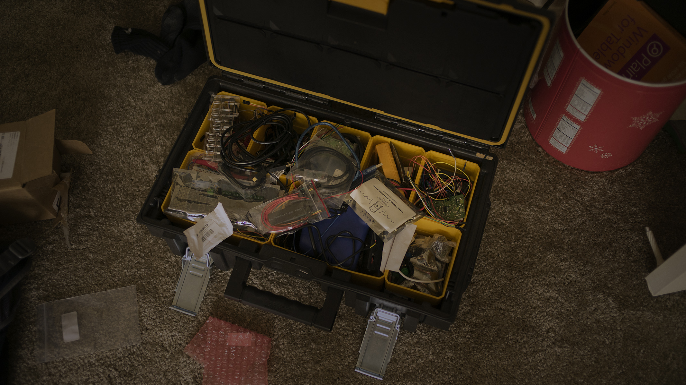
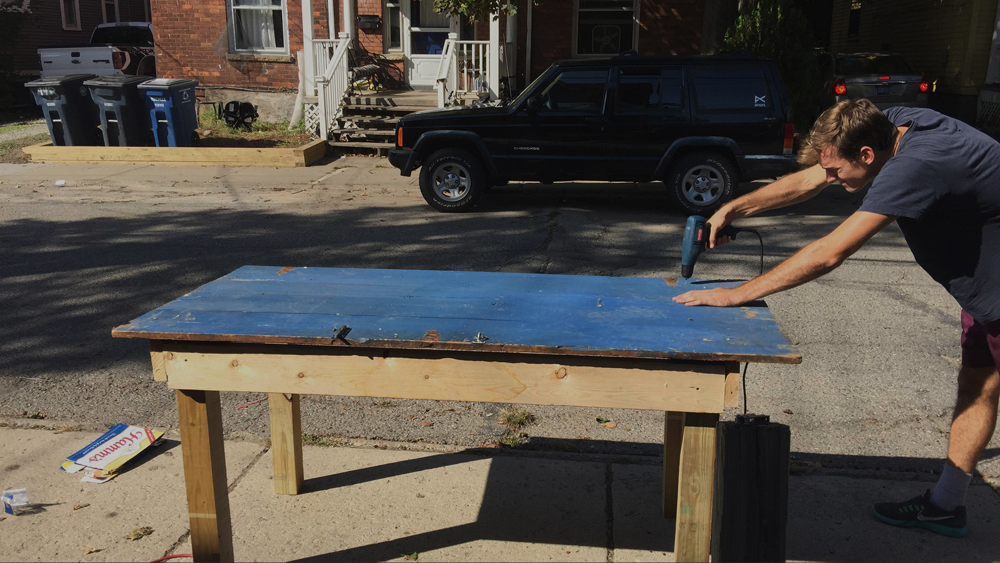
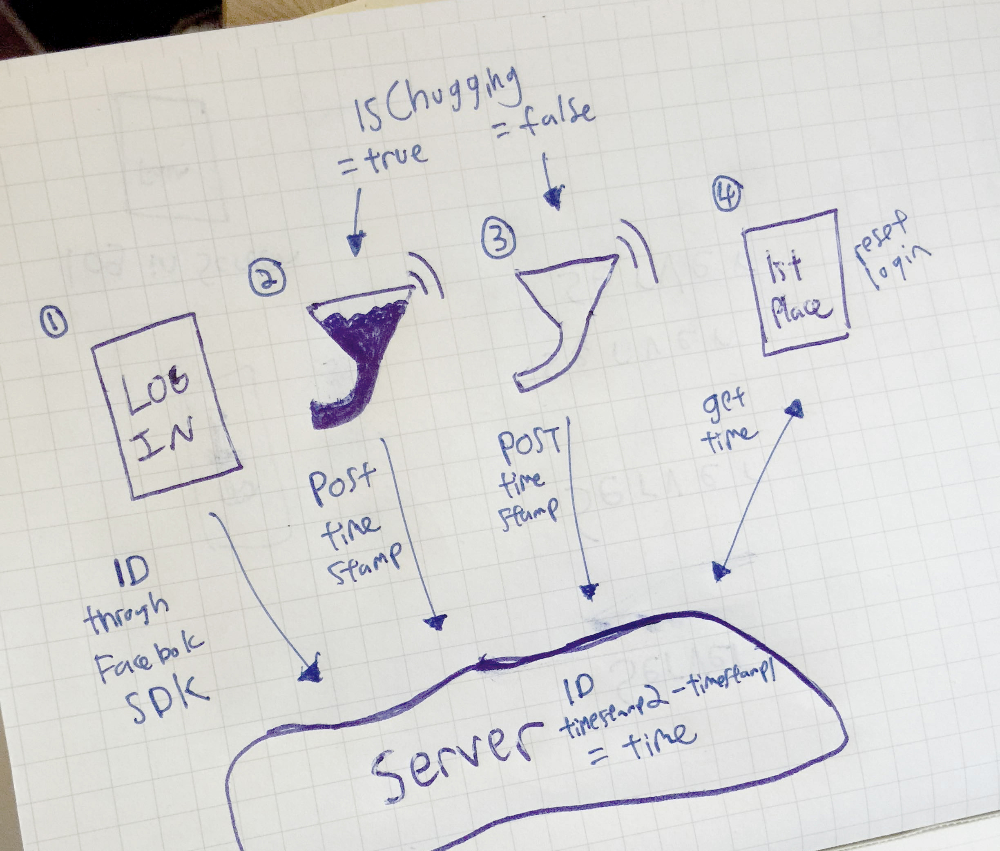
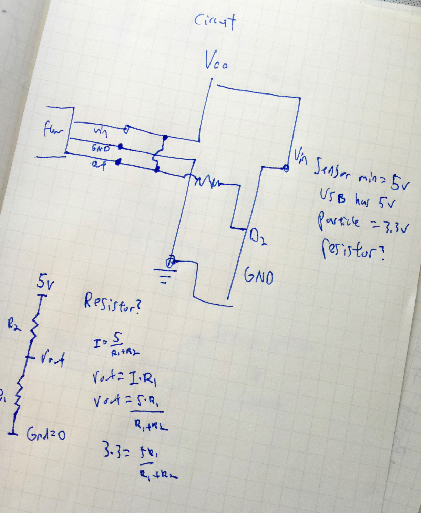
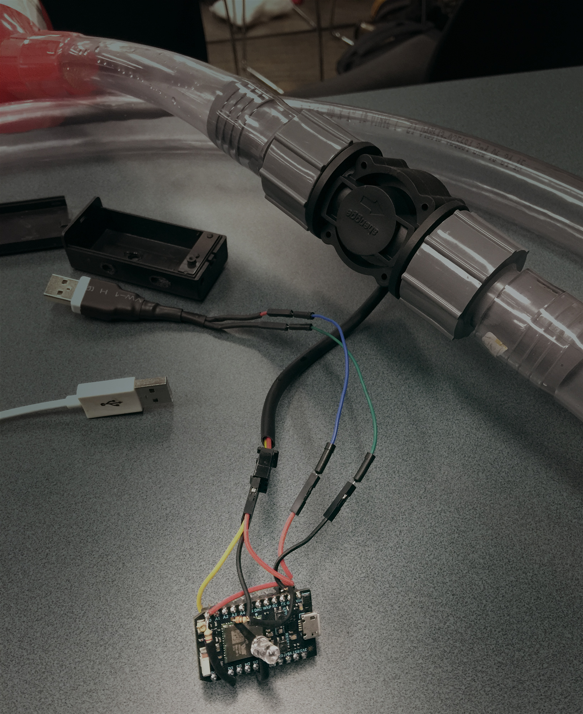
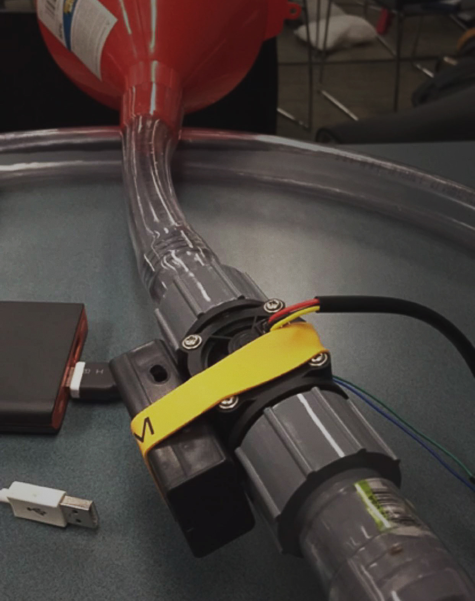
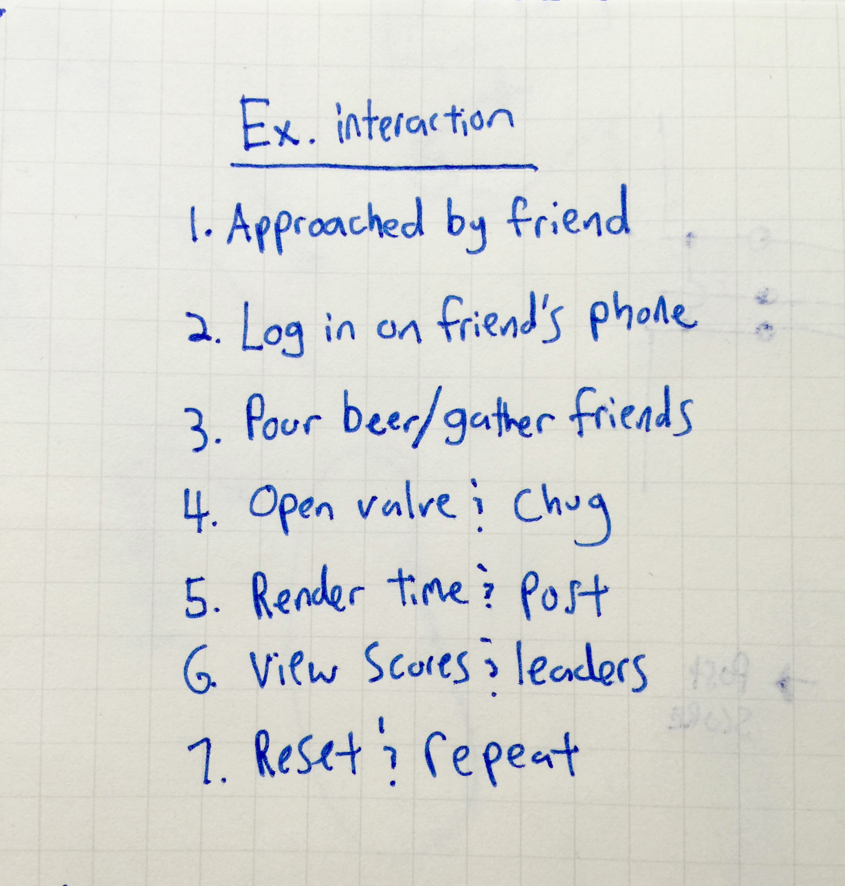
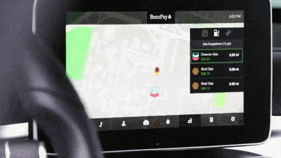
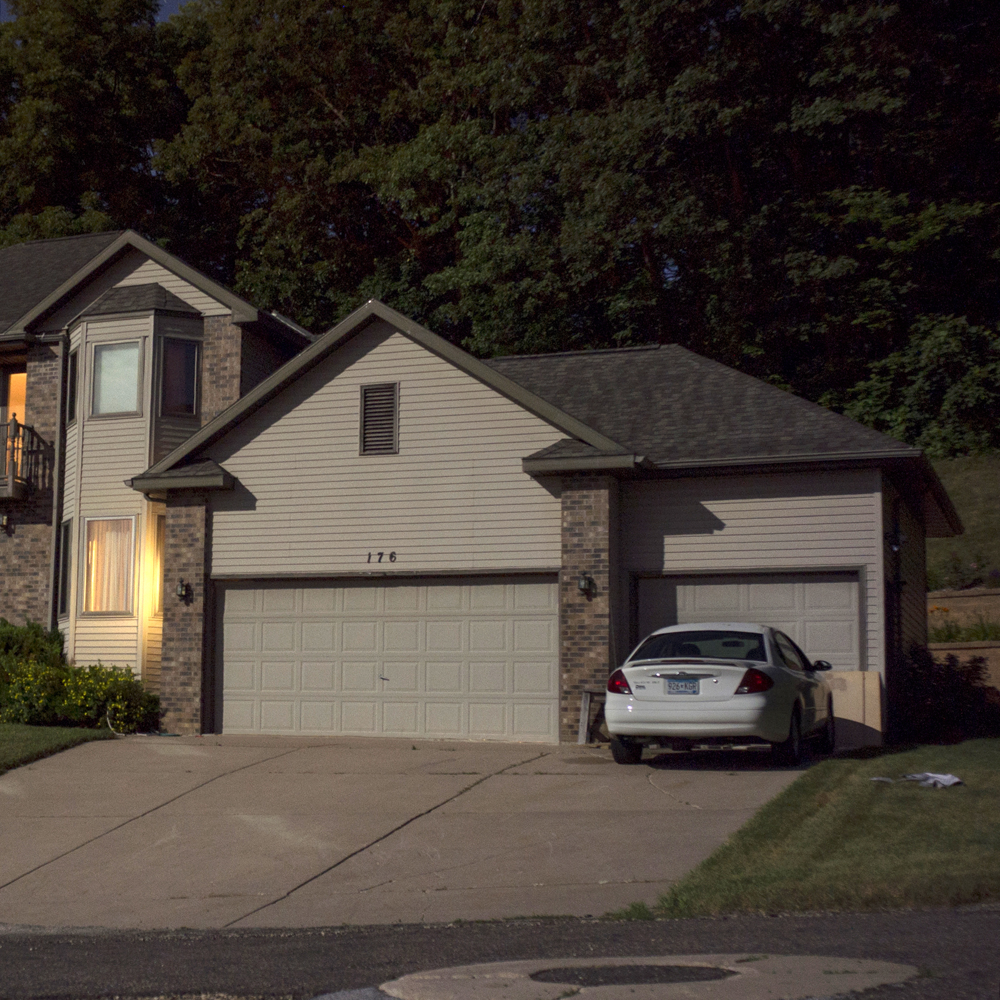

<!-- ---
layout: post
categories: project-item
img-path: images/beerbongcircle.jpg
project-title: Wifi Beerbong
--- -->

  

    

      

             <h1 class="title-main-about" id="projectIntro"> Wifi Beerbong</h1>
            
 <i> They say people who are really serious about software should make their own hardware, so one day I made an internet of things beer bong.</i>

        <!-- <h1 class="title-main-about">Inspiration</h1>

        
 I showed up to Mhacks 6 with a giant briefcase of hardware. It's really important for me to make things other people haven't, so whenever I find a novel gadget or sensor, I toss it in my hardware collection. 

          

          

            I flew in to Ann Arbor a few days early to visit a few friends at the school. Long story short, there was a block party, a bunch of people were standing on top of my friend's table and it snapped. 

             

            

            While looking for screws the next day at the hardware store, I come across something you would only see in Ann Arbor..... <i> In the gardening section there was an entire aisle dedicated to beer bong funnels, hoses, and accesories. </i> At that point, it became very clear to me that for Mhacks 6 I was going to make the world's first wifi enabled beer bong. 
 -->

              <h1 class="title-main-about">The world's first wifi enabled beerbong</h1>

          
 I had a lot of unanswered questions, so I started to lay them out in my notebook. Where am I getting power? How am I going to display the data? How can I make drinking a hyper-social activity?  

         
 A single device had to support multiple users, so it made sense to have a log-in feature that integrated well with social media.   

           

          <h1 class="title-main-about">Hardware constraints</h1>
         
 The annoying thing with <a href="https://www.particle.io/"> <b> Particle </b> </a> photons is that they run off 3.3v and a lot of sensors run off 5v. Since we were powering the photon with a usb battery pack, the original plan was to use that power with a voltage divider. I'm not an electrical engineer, so I just decided to just tap into the VIN of the photon. People were telling me not to do that, but it's been working as long as the ground wasn't floating around.  

       

       
 The only resistors I ended up needing were for the led indicators.   

      <h1 class="title-main-about">Wiring it up and weather proofing</h1>
       
 We fried the circuit while testing the flow sensor with some real liquid. When making the final changes to the circuit, I wasn't going to take any chances on shorting out the last board I had. Made sure this time nothing was hanging out in the open.   

       

       

              <h1 class="title-main-about">Software was a failure</h1>

              
  I did not work on our software for this project. The only code I wrote was for the arduino sending out a request. Nonetheless I still have an opinion about the software.

                

                 
   Some features, like the score ranking, we just didn't get around to implementing. Other features, like the facebook login, I think we could have been better off avoiding. Although it's important for social games to link to social profiles, I think there are easier ways for someone to login than to type in their facebook email and password. In the future, one option I would love to explore would be installing a camera on the beerbong and leveraging a facial recognition service to tag participants.

                  <h1 class="title-main-about">Check it out</h1>

           <!--    
 <b> <a href="http://www.drankboard.co/"> http://www.drankboard.co/ </b></a> -->

                

                 
 <a href="https://github.com/drankadank"><b> Github </b></a>

                   <!-- DESKTOP FOOTER NAV -->

              

               

                  <h1 class="title-main-about" id="footer-caption">
                More Projects <h1> </a>

              

                

                       

                         

                           

                              <a href="/project-item/Mercedes/">
                              
                                  
<b> Mercedes</b>
 </a>

                           

                             

                              <a href="/project-item/AirQuail/">
                              
                                  
<b> Airquail</b>
 </a>

                           

                              

                              <a href="/project-item/As-One/">
                              
                                  
<b> asOne</b>
 </a>

                           

                                 

                              <a href="/project-item/BenzPay/">
                              
                                  
<b> Benzpay</b>
 </a>

                           

<!--
                            

                              <a href="/project-item/More-Projects/">
                              
                                  
<b> More</b>
 </a>

                           
 -->

                             

                              <a href="/">
                              
                                  
<b> Home</b>
 </a>

                           

                    

                   

                  

        

      

    

  

<!--   

  

   

    

          

         We short circuited everything on our first test. Luckily I had a seconded particle photon with me. Made sure our enclosure was waterproof.
        

           

    

  

 -->
